# SoundHub Architecture

This document provides an overview of the SoundHub architecture, including the monorepo structure, API layers, and device adapter pattern.

## High-Level Architecture

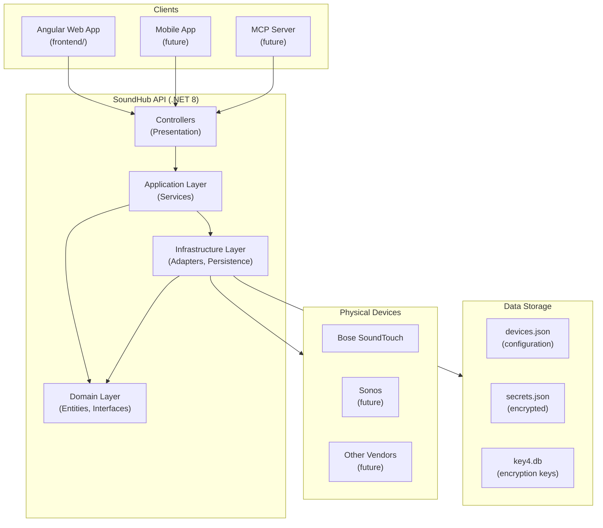

## Monorepo Structure

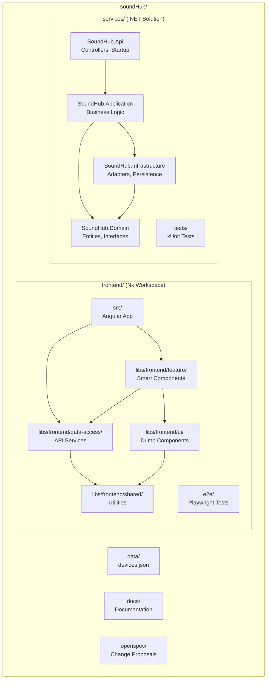

## .NET API Layers

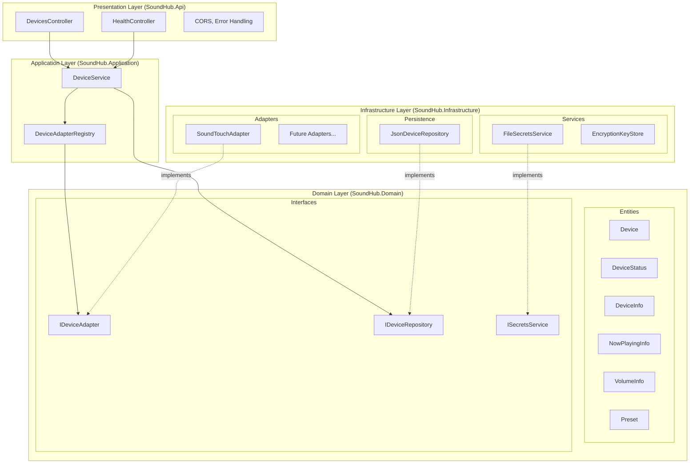

## Device Adapter Pattern

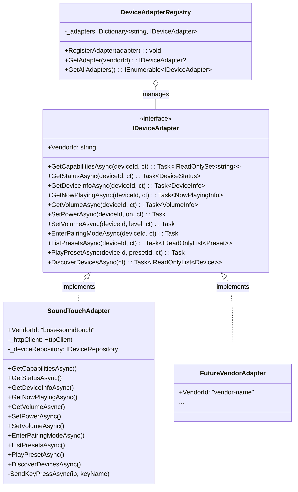

## Docker Deployment

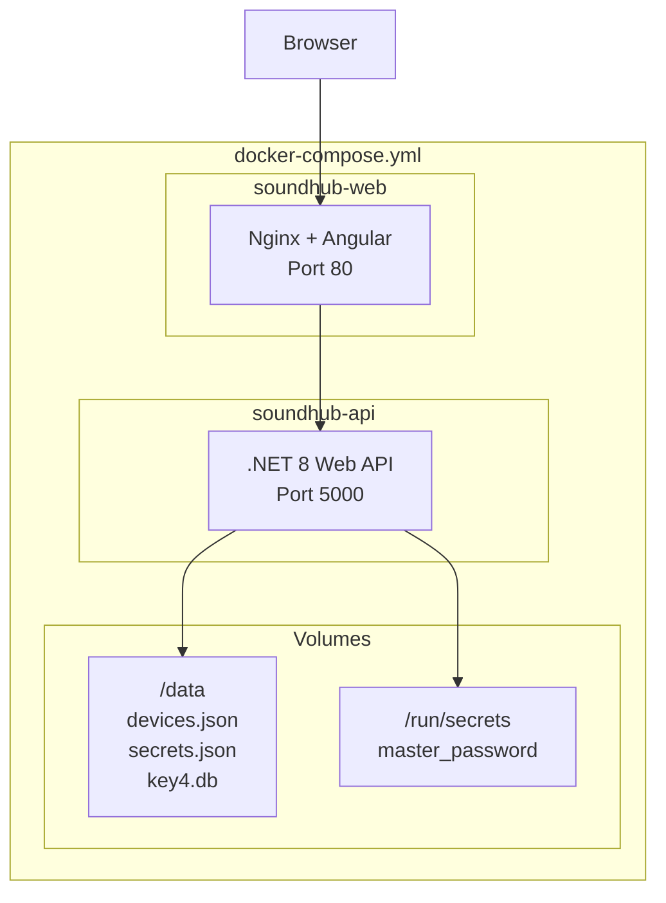

## Data Flow: Device Control

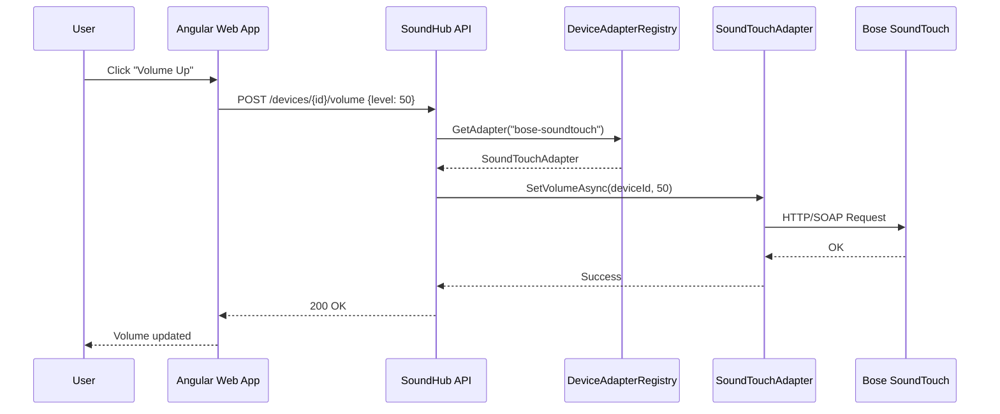

## Data Flow: Power Toggle

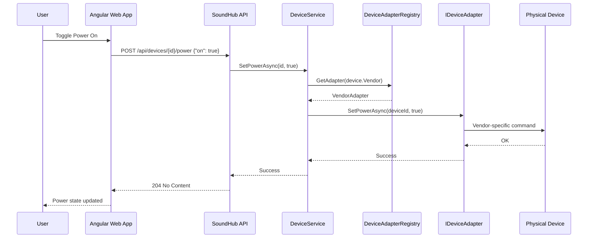

## SoundTouch API Communication

The SoundTouchAdapter communicates with Bose SoundTouch devices via HTTP on port 8090:

```mermaid
sequenceDiagram
    participant Adapter as SoundTouchAdapter
    participant Device as SoundTouch Device<br/>(port 8090)

    Note over Adapter,Device: GET Requests (status, info, presets)
    Adapter->>Device: GET /info
    Device-->>Adapter: XML (deviceID, name, type, version)
    
    Adapter->>Device: GET /nowPlaying
    Device-->>Adapter: XML (source, track, artist, album)
    
    Adapter->>Device: GET /volume
    Device-->>Adapter: XML (targetvolume, actualvolume, muteenabled)
    
    Adapter->>Device: GET /presets
    Device-->>Adapter: XML (preset 1-6 with ContentItem)

    Note over Adapter,Device: POST Requests (control)
    Adapter->>Device: POST /volume<br/>&lt;volume&gt;50&lt;/volume&gt;
    Device-->>Adapter: 200 OK

    Note over Adapter,Device: Key Press Pattern (power, presets)
    Adapter->>Device: POST /key<br/>&lt;key state="press"&gt;PRESET_1&lt;/key&gt;
    Device-->>Adapter: 200 OK
    Note over Adapter: Wait 100ms
    Adapter->>Device: POST /key<br/>&lt;key state="release"&gt;PRESET_1&lt;/key&gt;
    Device-->>Adapter: 200 OK
```

### SoundTouch Endpoints

| Endpoint | Method | Description |
|----------|--------|-------------|
| `/info` | GET | Device info (name, type, MAC, software version) |
| `/nowPlaying` | GET | Current playback (source, track, artist, album) |
| `/volume` | GET | Volume state (target, actual, mute) |
| `/volume` | POST | Set volume (`<volume>0-100</volume>`) |
| `/presets` | GET | List presets 1-6 |
| `/key` | POST | Key press/release (POWER, PRESET_1-6) |
| `/standby` | GET | Enter standby mode |
| `/enterBluetoothPairing` | GET | Enter Bluetooth pairing mode |

## Frontend Library Architecture

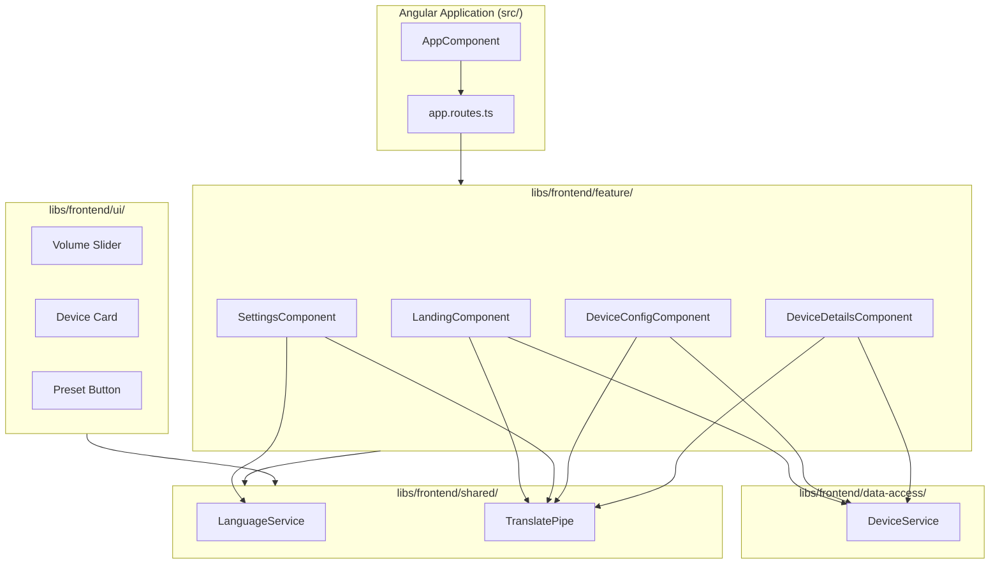

## Web UI Routes

| Route | Component | Description |
|-------|-----------|-------------|
| `/` | LandingComponent | Displays list of configured devices with navigation to settings and device details |
| `/settings` | SettingsComponent | Language selection (English/Polish) and navigation to device configuration |
| `/settings/devices` | DeviceConfigComponent | Lists configured devices with navigation to device details |
| `/devices/:id` | DeviceDetailsComponent | Device control page with power on/off toggle |

## Internationalization (i18n)

The frontend supports runtime language switching between English and Polish:

- **LanguageService**: Signal-based service that manages current language and translations
- **TranslatePipe**: Pipe for translating keys in templates
- **Persistence**: Selected language is stored in `localStorage` under `soundhub-language`

## Device Configuration Management

SoundHub provides comprehensive device configuration capabilities through both the web UI and REST API.

### Device Configuration Flow

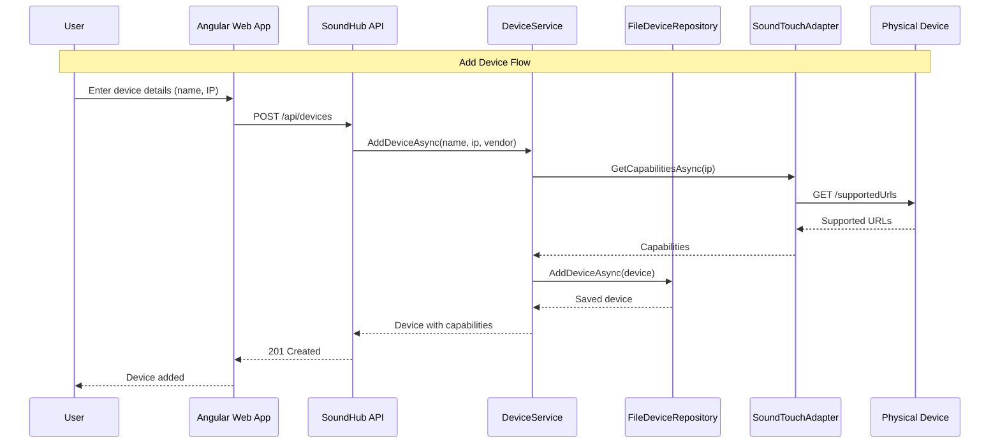

### Device Discovery Flow

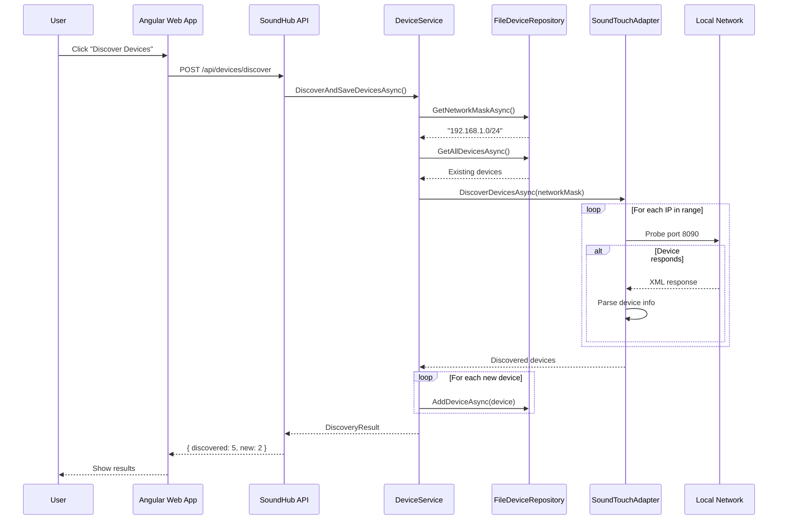

### Device Ping Flow

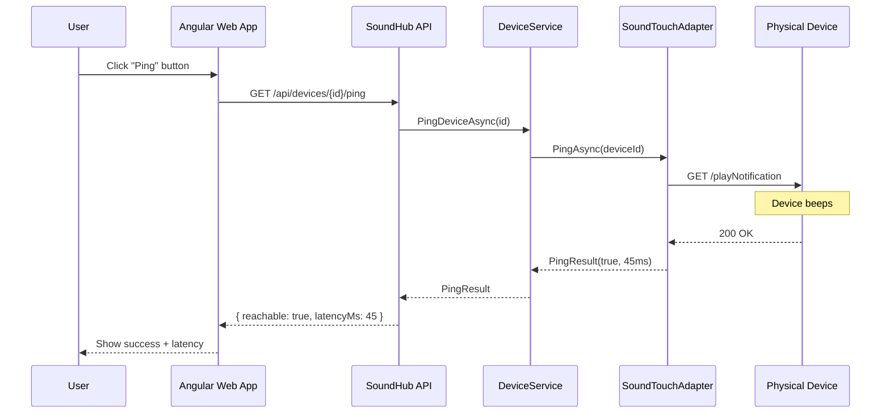

### Configuration Persistence

The device configuration is persisted in `devices.json` with the following structure:

```json
{
  "NetworkMask": "192.168.1.0/24",
  "SoundTouch": {
    "Devices": [
      {
        "Id": "uuid",
        "Vendor": "bose-soundtouch",
        "Name": "Living Room Speaker",
        "IpAddress": "192.168.1.100",
        "Capabilities": ["power", "volume", "presets", "ping"],
        "DateTimeAdded": "2025-12-31T12:00:00.000Z"
      }
    ]
  }
}
```

**Key Points:**
- `NetworkMask` is stored at the root level for vendor-agnostic discovery
- Devices are grouped by vendor display name
- Capabilities are detected from the device and stored
- `DateTimeAdded` is used to highlight newly added devices in the UI
- Dynamic state (volume, power, online) is not persisted; it's read on-demand

## Key Design Principles

1. **Separation of Concerns**: Clear boundaries between layers (Domain, Application, Infrastructure, Presentation)
2. **Dependency Inversion**: Core layers depend on abstractions, not implementations
3. **Device Adapter Pattern**: Vendor-specific logic is encapsulated in adapters implementing `IDeviceAdapter`
4. **Per-Device Capability Discovery**: Each device reports its capabilities, enabling heterogeneous device support
5. **API-First Design**: OpenAPI spec drives development; code implements the contract
6. **Container-First**: Docker Compose provides consistent dev/prod environments
