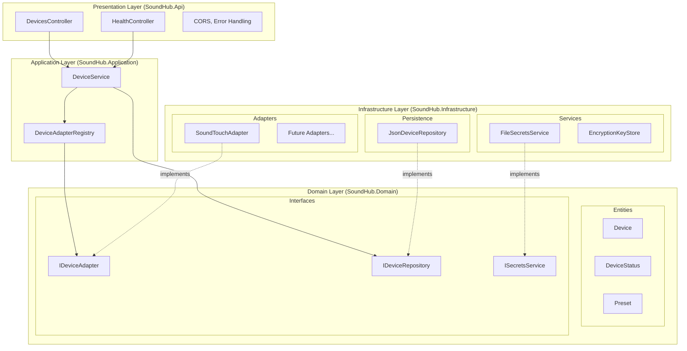
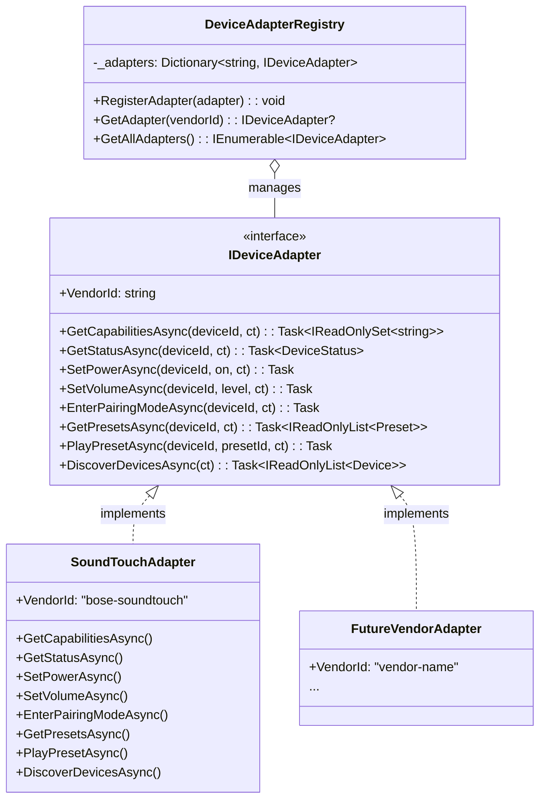

# SoundHub Architecture

This document provides an overview of the SoundHub architecture, including the monorepo structure, API layers, and device adapter pattern.

## High-Level Architecture

## Monorepo Structure

## .NET API Layers

## Device Adapter Pattern

## Docker Deployment

## Data Flow: Device Control

## Data Flow: Power Toggle

## Frontend Library Architecture

## Web UI Routes

| Route | Component | Description |
|-------|-----------|-------------|
| `/` | LandingComponent | Displays list of configured devices with navigation to settings and device details |
| `/settings` | SettingsComponent | Language selection (English/Polish) and navigation to device configuration |
| `/settings/devices` | DeviceConfigComponent | Lists configured devices with navigation to device details |
| `/devices/:id` | DeviceDetailsComponent | Device control page with power on/off toggle |

## Internationalization (i18n)

The frontend supports runtime language switching between English and Polish:

- **LanguageService**: Signal-based service that manages current language and translations
- **TranslatePipe**: Pipe for translating keys in templates
- **Persistence**: Selected language is stored in `localStorage` under `soundhub-language`

## Key Design Principles

1. **Separation of Concerns**: Clear boundaries between layers (Domain, Application, Infrastructure, Presentation)
2. **Dependency Inversion**: Core layers depend on abstractions, not implementations
3. **Device Adapter Pattern**: Vendor-specific logic is encapsulated in adapters implementing `IDeviceAdapter`
4. **Per-Device Capability Discovery**: Each device reports its capabilities, enabling heterogeneous device support
5. **API-First Design**: OpenAPI spec drives development; code implements the contract
6. **Container-First**: Docker Compose provides consistent dev/prod environments
