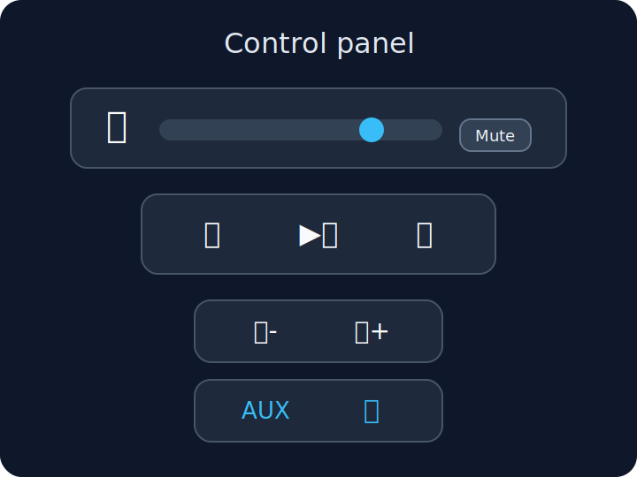

# SoundHub Web UI — User Manual

## Table of contents
- [Overview](#overview)
- [Prerequisites](#prerequisites)
- [Quick start (first successful use)](#quick-start-first-successful-use)
- [Screen map (where to find things)](#screen-map-where-to-find-things)
- [Change the language](#change-the-language)
- [Add a device](#add-a-device)
  - [Option A — Discover devices](#option-a--discover-devices-scan-your-network)
  - [Option B — Add manually](#option-b--add-a-device-manually)
- [Edit or remove a device](#edit-or-remove-a-device)
- [Check connectivity (Ping)](#check-connectivity-ping)
- [Control a device (device details page)](#control-a-device-device-details-page)
- [Use the remote control buttons](#use-the-remote-control-buttons)
- [Manage presets](#manage-presets)
- [Now Playing LCD display](#now-playing-lcd-display)
- [Troubleshooting](#troubleshooting)
- [Related docs](#related-docs)

## Overview
SoundHub is a web app for controlling audio devices on your local network (for example Bose SoundTouch). You can:

- Add and discover devices
- Turn a device on/off
- Adjust volume and mute
- Use remote-style playback/source controls
- Manage presets
- View “Now Playing” information and customize the LCD display style

## Prerequisites
- SoundHub is already running on your network or computer.
- Your phone/tablet/computer is on the same local network as the audio device(s).
- A modern browser (Chrome, Edge, Firefox, Safari).

**Note:** In a typical local setup, SoundHub is available at `http://localhost:5002`.

## Quick start (first successful use)
**Goal:** Open the app, add one device, and change volume.

**Prerequisites:** You know the device IP address *or* you know your home network range (for discovery).

1. Open SoundHub in your browser.
2. On the landing page, select a device (or go to **Settings** → **Device Configuration** / **Manage Devices**).
3. Add a device (see [Add a device](#add-a-device) below).
4. Return to the landing page and select the device.
5. On the device details page, turn the device on (if needed).
6. Move the **Volume** slider.

**Expected result:** The device appears in the app, powers on, and the volume changes.

## Screen map (where to find things)
- **Landing page** (`/`): list of configured devices, link to **Settings**
- **Settings** (`/settings`): language selection, LCD display settings, link to device configuration
- **Device Configuration** (`/settings/devices`): discover/add/edit/remove devices, set **Network Mask**, **Ping** devices
- **Device details** (`/devices/:id`): power, volume/mute, remote control buttons, presets, now playing

## Change the language
**Goal:** Switch the UI language between English and Polish.

1. Open **Settings**.
2. In **Language**, select **English** or **Polish**.

**Expected result:** The UI text changes immediately and is remembered next time.

## Add a device
You can add devices in two ways: discovery (scan) or manual entry.

### Option A — Discover devices (scan your network)
**Goal:** Automatically find compatible devices on your local network.

**Prerequisites:** You know the network range where your devices live (CIDR format).

1. Open **Settings** → **Device Configuration**.
2. In **Network Mask**, enter your network in CIDR notation (example: `192.168.1.0/24`).
3. Select **Save** (if present).
4. Select **Discover Devices**.
5. Wait for the scan to finish.

**Expected result:** Newly discovered devices appear in the device list. Devices added recently may be highlighted.

**Trouble tip:** If discovery refuses to start, set a valid **Network Mask** first.

### Option B — Add a device manually
**Goal:** Add a device by entering its details.

**Prerequisites:** You know the device IP address (or hostname).

1. Open **Settings** → **Device Configuration**.
2. Select **Add Device** (or the **+** button).
3. Fill in the required fields:
   - **Name**
   - **IP Address** (or hostname)
   - **Vendor**
   - **Capabilities** (checkboxes)
4. Select **Save**.

**Expected result:** The device appears in the configured device list.

**Tip:** Use a static IP (or DHCP reservation) so the device IP does not change.

## Edit or remove a device
### Edit a device
**Goal:** Change a device name, IP address, vendor, or capabilities.

1. Open **Settings** → **Device Configuration**.
2. Select the device (or choose **Edit**).
3. Change the fields you need.
4. Select **Save**.

**Expected result:** The device list shows the updated information.

### Remove a device
**Goal:** Remove a device from SoundHub.

1. Open **Settings** → **Device Configuration**.
2. Select **Delete** (or **Remove**) for the device.
3. Confirm the deletion.

**Expected result:** The device no longer appears in SoundHub.

**Warning:** This only removes the device from SoundHub. It does not change the physical device.

## Check connectivity (Ping)
**Goal:** Verify SoundHub can reach the device.

**Prerequisites:** The device has the **ping** capability.

1. Open **Settings** → **Device Configuration**.
2. Find your device and select **Ping**.

**Expected result:** If supported, the device plays an audible double-beep and the UI shows success.

## Control a device (device details page)
### Turn power on/off
**Goal:** Put the device into an on/off (standby) state.

1. From the landing page, select your device.
2. Select the **Power** button.

**Expected result:** The UI reflects the new power state.

### Adjust volume and mute
**Goal:** Change volume and mute/unmute.

**Prerequisites:** The device supports the **volume** capability.

1. On the device details page, ensure the device is powered on.
2. Drag the **Volume** slider to the desired level (0–100).
3. Select **Mute** to mute the device.
4. Select **Unmute** to return to the previous level.

**Expected result:** Volume changes take effect on the device. If the device is off, the controls are disabled.

## Use the remote control buttons
SoundHub shows a compact remote-style control surface on the device details page.

### Playback controls
**Goal:** Control previous/next track and play/pause.

1. On the device details page, ensure the device is powered on.
2. Use:
   - **Previous track**
   - **Play or pause**
   - **Next track**

**Expected result:** The device responds to playback commands (and the UI may briefly show loading).

### Volume shortcuts
**Goal:** Nudge volume up/down with one tap.

1. Ensure the device is powered on.
2. Select **Volume up** or **Volume down**.

**Expected result:** Volume changes in small steps.

### Switch to AUX
**Goal:** Change the device source to AUX.

1. Ensure the device is powered on.
2. Select **Switch to AUX**.

**Expected result:** AUX becomes active (when supported by the device/backend).

### Start Bluetooth pairing
**Goal:** Put the device into Bluetooth pairing mode.

**Prerequisites:** The device supports **bluetoothPairing**.

1. Ensure the device is powered on.
2. Select **Start Bluetooth pairing**.

**Expected result:** The device enters pairing mode.

## Manage presets
Presets are saved “slots” you can play quickly (often 1–6 on SoundTouch devices).

### Play a preset
**Goal:** Start playback from an existing preset.

1. Open the device details page.
2. In the **Presets** section, select a preset’s play button.

**Expected result:** The device starts playing that preset.

### Add or edit a preset
**Goal:** Create a new preset or update an existing one.

**Prerequisites:** The device supports the **presets** capability.

1. Open the device details page.
2. Enter preset edit mode (typically via a presets **Settings** button).
3. Select **Add Preset** (or the add button).
4. Fill in the form:
   - **Preset Slot (1–6)**
   - **Name**
   - **Location URL**
   - Optional: **Image URL**, **Type**, **Source**
5. Select **Save**.

**Expected result:** The preset appears in the preset list and can be played.

### Delete a preset
**Goal:** Remove a preset from the device.

1. Open the preset edit form.
2. Select **Delete**.
3. Confirm.

**Expected result:** The preset is removed.

## Now Playing LCD display
When a device is powered on, SoundHub can show an LCD-style “Now Playing” display on the device details page.

### View now playing
**Goal:** See what is currently playing.

1. Open the device details page.
2. Turn the device on.

**Expected result:** The LCD display appears and shows the current station/artist/track. Long text may scroll.

### Customize LCD settings (theme and speed)
**Goal:** Change the LCD color theme and scroll speed.

1. Open **Settings**.
2. Find **LCD Display** (or **Wyświetlacz LCD**).
3. Choose a scroll speed: **Slow / Medium / Fast**.
4. Choose a color theme: **Green / Amber / Blue**.

**Expected result:** The preview updates, and your choice applies across device pages.

## Troubleshooting
### Devices list is empty
- Make sure you have added at least one device in **Settings** → **Device Configuration**.
- If you expected discovery to work, confirm the **Network Mask** is set (example `192.168.1.0/24`).

### Discovery does not find devices
- Confirm the device is powered on and connected to the same network.
- Try a smaller network range (for example `/24`).
- If the IP range is wrong, discovery will miss the device.

### Ping fails
- Confirm the device IP address is correct.
- Confirm your computer and the device are on the same LAN/VLAN.
- Some devices do not support audible ping; the button may not appear.

### Volume / remote buttons are disabled
- The device is likely powered off. Turn it on with the **Power** button.
- If it stays disabled after powering on, wait a few seconds for the device status to load.

### Language did not change
- Return to **Settings** and re-select the language.
- If the text still does not update, refresh the page as a fallback.

## Related docs
- Device configuration details: [device-configuration-guide.md](device-configuration-guide.md)
- API reference (advanced): [api-reference.md](api-reference.md)
